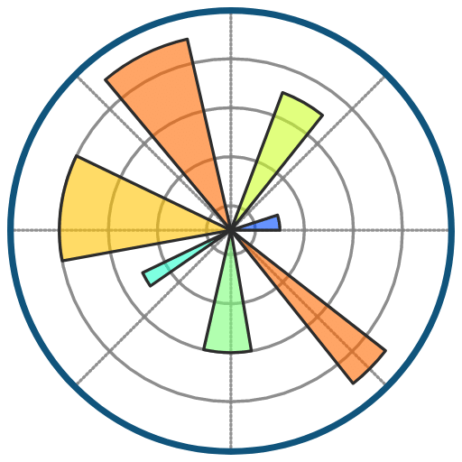

<h1 align="center">Привет 👋, меня зовут Сергей</h1>
<h3 align="center"> <a href="https://sergeytsvl.github.io/tsaser.github.io/"> Я бэкенд-разработчик на Python (портфолио)</a></h3>

  
  

  
  

<h3 align="center">Мой стек в разработке:</h3>

  
  
  
  
  
  
  
  
  
  
  
  
  
  
  
  
  
  
  
  
  
  
  
  
  
  
  
  
  
  
  
  
  
  
  

